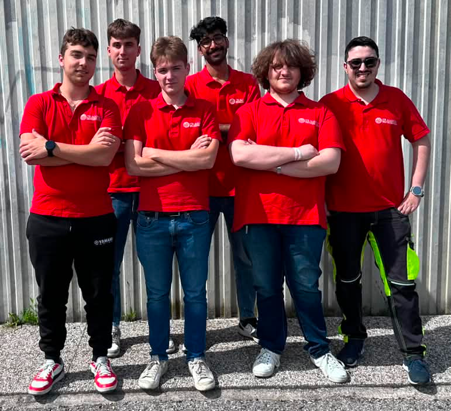
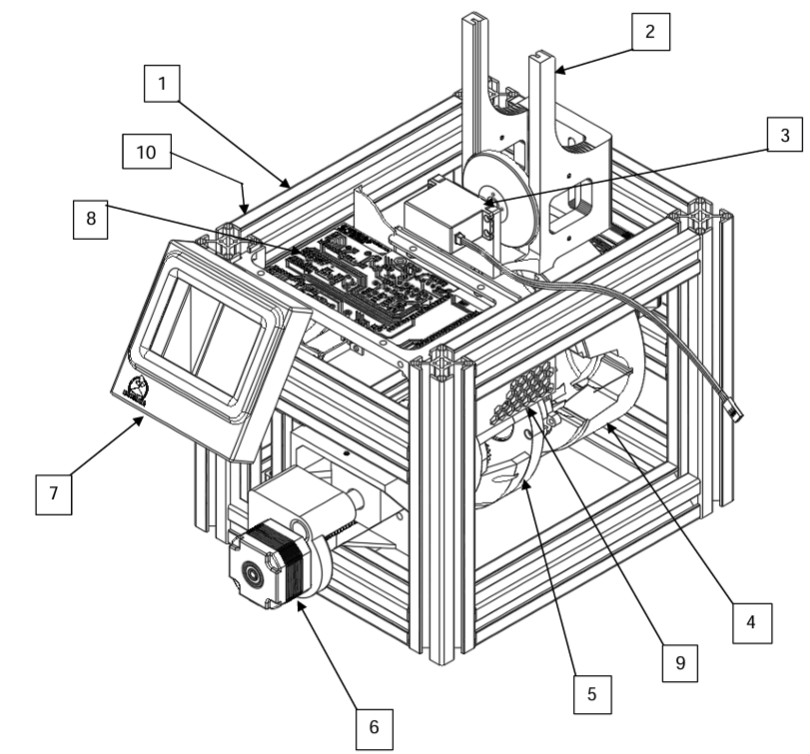
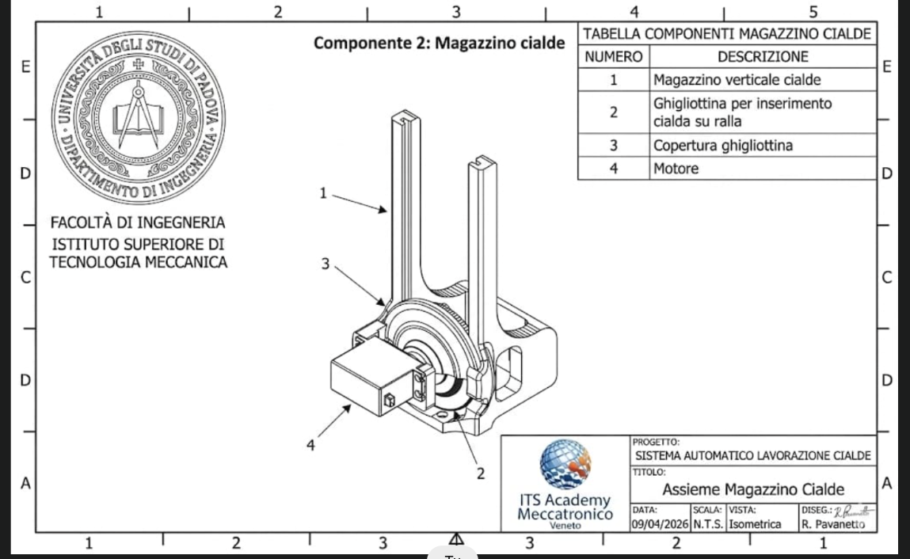
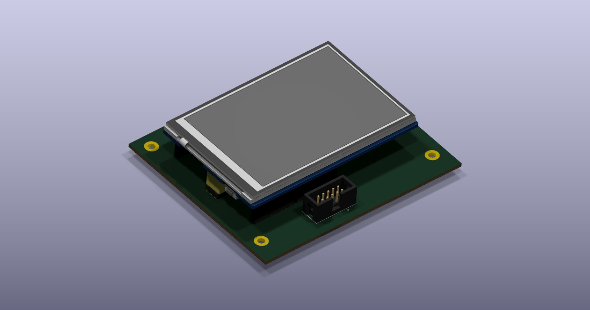
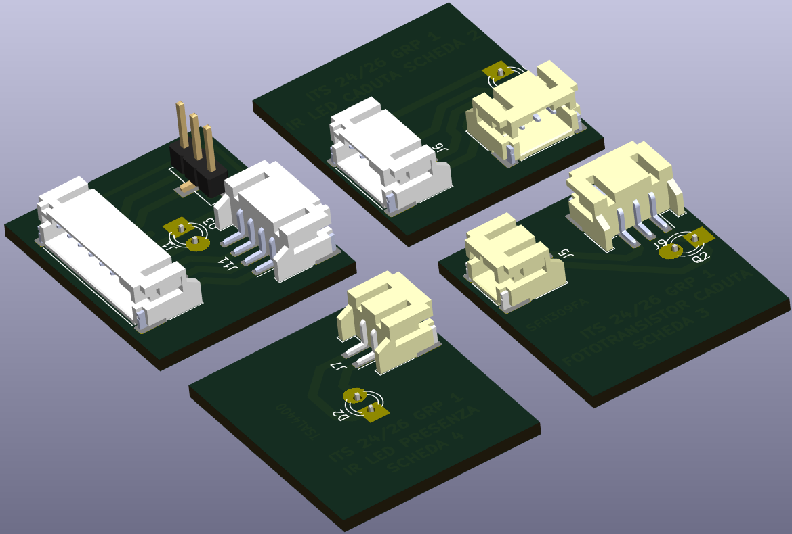
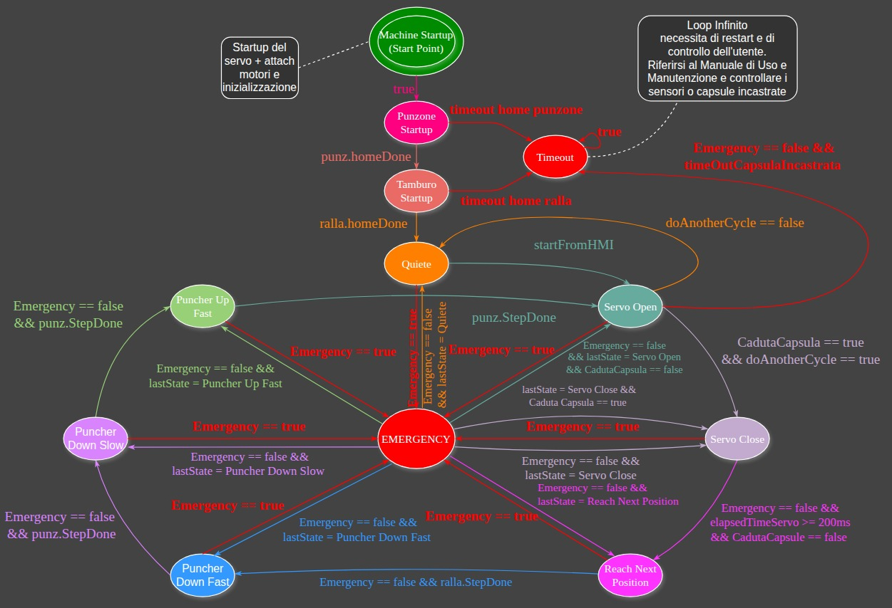
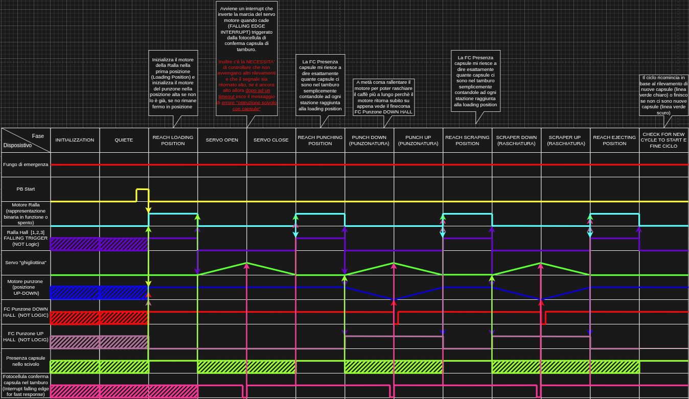
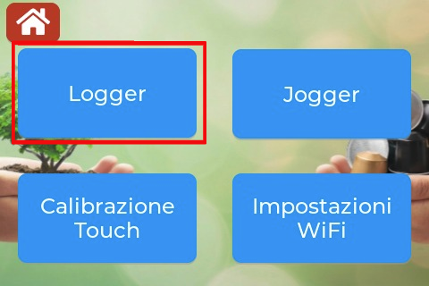
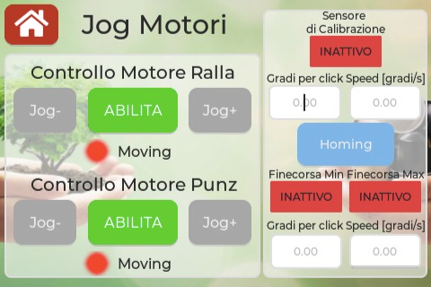

# Decapsulator
<p align="center">
  
</p>

<p align="center">
  <em>Repo condiviso con il Gruppo 1 ITS 24-26 con programma del macchinario</em>
</p>

---

## Overview
**Decapsulator** è il prototipo di un macchinario nato con lo scopo principale di ridurre rifiuti secchi automatizzando un processo ripetitivo, che tende ad essere evitato e talvolta può diventare pericoloso se non si prestano le dovute attenzioni che è quello di aprire le capsule esauste per poter separare il caffè dall'involucro esterno.

**Sedi**: 
- **IIS Einaudi-Scarpa** : Via Sansovino, 6, 31044 Montebelluna (TV)
- **IPSIA Barsanti-Galilei** : Via Avenale, 6, 31033 Castelfranco Veneto (TV) 

---

## Intended Use 
Prototipo a scopo didattico, non destinato alla vendita o all'uso continuativo. In caso di vendita a scopo commerciale saranno da integrare tutti i dispositivi di sicurezza descritti nelle norme vigenti nella data di revisione e modifica del prototipo successiva a quella descritta dal documento di uso e manutenzione. 

---

## Features
- Automatizzazione della separazione delle capsule dal caffè
- Orientato alla facilità di utilizzo e di manutenzione
- FreeRTOS per avere un controllo real time del processo
- Sicurezza del macchinario
- Prototipo modulabile per diversi tipi di capsule cambiando pochissimi componenti
- Il suo sviluppo ha contribuito in piccola parte al mondo dell'Open Hardware di disegni CAD 3D.
- Design compatto rivolto ad un ambiente domestico

---

## Authors
- ***Manuel Randazzo*** - Firmware Designer, Backend Firmware Developer, Integration Developer, Firmware Tester, Electrical Designer, Electrical tester, Mechanical Designer, Documentation Contributor.
- ***Alessio Pisan*** - Electrical Designer, Electrical Tester, Frontend Firmware Developer, Backend Firmware Developer, Firmware Tester, Documentation Contributor.
- ***Riccardo Pavanetto*** - Mechanical Designer, Mechanical Designer
- ***Federico Dorigo*** - Scrum Master, Procurement Coordinator, Documentation Coordinator, Payroll Administrator
- ***Christian Poletti*** - Documentation Contributor
- ***Arun James Thanamcheril*** - Documentation Contributor


<p align="center">
  
</p>
<p align="center">
    <em>Foto del gruppo 1 ITS 24-25 - foto scattata nel 2025.</em>
    <em>Partendo da sinistra : Manuel, Christian, Alessio, Riccardo e Federico</em>
</p>

<p align="center">
  
</p>
<p align="center">
    <em>Foto del gruppo 1 ITS 25-26 - foto scattata nel 2026.</em>
    <em>Partendo da sinistra : Federico, Christian, Riccardo, Arun James, Manuel e Alessio</em>
</p>

---

## Dichiarazione Di Conformità CE Del Prototipo
Il presente prototipo è stato progettato seguendo i criteri di sicurezza delle varie direttive:  
- ***Direttiva Macchine 2006/42/CE***: Poiché l'apparecchio presenta organi in movimento, tra cui tamburo rotante, paratia di selezionatura servo-attivata e punzone, i quali comportano rischi meccanici.

- ***Direttiva Bassa Tensione (LVD) 2014/35/UE***: Consultata per la sicurezza dei componenti elettrici e dei circuiti di alimentazione.

- ***Direttiva Compatibilità Elettromagnetica (EMC) 2014/30/UE***: Applicabile per garantire che l’elettronica non interferisca con altre apparecchiature circostanti al macchinario.

- ***Direttiva RoHS 2011/65/UE***: Consultata per garantire l'assenza di sostanze pericolose nei componenti elettronici e nei materiali di apporto. 

Norme armonizzate applicate :
- ***UNI EN ISO 12100:2010***: Sicurezza del macchinario - Principi generali di progettazione - Valutazione e attenuazione del rischio. 

- ***UNI EN ISO 13857:2020***: Distanze di sicurezza per impedire il raggiungimento di zone pericolose con gli arti superiori (utilizzata per dimensionare l'imbocco delle capsule e i carter del tamburo).

- ***UNI EN ISO 14119:2013***: Dispositivi di interblocco associati ai ripari (utilizzata per la scelta e l'installazione del micro-switch di sicurezza sul coperchio).

- ***CEI EN 60204-1***: Sicurezza dell'equipaggiamento elettrico delle macchine (utilizzata per lo schema elettrico e funzionale). 

---

## Disegno Prototipo E Componenti Principali
- ### **Parte Meccanica**
<p align="center">
  
</p>

<p align="center">
  <em>Figura 1 — Architettura generale del Decapsulator</em>
</p>
 
**Tabella Componenti :**

| N° |  Descrizione  |
|----|---------------|
| 1  | Profili in alluminio 30x30 cm |
| 2  | Magazzino verticale capsule |
| 3  | Paratia di selezionatura servoattivata del magazzino verticale |
| 4  | Tamburo di posizionamento |
| 5  | Zona di Punzonatura e Raschiatura |
| 6  | Motore passo-passo del Punzone e Raschiatore |
| 7  | Display dell’interfaccia uomo-macchina (HMI) |
| 8  | Scheda elettronica |
| 9  | Griglia di protezione parte elettronica |
| 10 | Ventola di raffreddamento (lato sinistro del macchinario) |

<p align="center">
  
</p>

<p align="center">
  <em>Figura 2 — Magazzino Cialde : Serve per stoccare le capsule prima che vengano </em>
</p>

<p align="center">
  
</p>

<p align="center">
  <em>Figura 3 — Tamburo : Serve per trasportare la capsula nelle varie fasi di lavorazione (Acquisizione, Punzonatura, Raschiatura, Espulsione)</em>
</p>

- ### **Parte Elettronica**

<p align="center">
  
</p>

<p align="center">
  <em>Figura 4 — Scheda di controllo del Decapsulator</em>
</p>


<p align="center">
  
</p>

<p align="center">
  <em>Figura 5 — Scheda HMI del Decapsulator</em>
</p>

<p align="center">
  
</p>

<p align="center">
  <em>Figura 5 — Scheda HMI del Decapsulator - Vista retro</em>
</p>

<p align="center">
  
</p>

<p align="center">
  <em>Figura 6 — Schede del "Magazzino Cialde" del Decapsulator, rappresentano due foto transistor e due LED IR, inoltre su una scheda è presente il connettore 3 poli del servomotore della "Paratia"</em>
</p>

---

## Sequenza Di Funzionamento Automatico Del Decapsulator
Il "Decapsulator" quando viene pilotato in modalità automatica per aprire le capsule di caffè segue questo diagramma :
<p align="center">
  
</p>

Il quale temporalmente si traduce in questa sequenza osservando i componenti :
<p align="center">
  
</p>


---

## Dati Sui Motori Utilizzati
Le librerie del driver DRV8825 sono state sviluppate interamente da Manuel Randazzo il quale si è preoccupato di studiare e testare l'hardware, consultare la documentazione ufficiale per poter integrare al meglio la libreria che può essere inclusa così :
```C++
#include "DRV8825_Decapsulator.hpp"
```
oppure includendo la libreria del Motion Controller che già utilizza internamente la precedente libreria e che permette una gestione più semplice del Motore :
```C++
#include "MotionControl.hpp"
```

**Flow chart MotionController**
<p align="center">
  
</p>

<p align="center">
  <em>Figura 7 — Flow chart MotionController</em>
</p>


**Simulazione Grafico Coppia-Velocità Motori Stepper**
<p align="center">
  
</p>

<p align="center">
  <em>Figura 8 — Simulazione curva di coppia dei motori stepper con MATLAB</em>
</p>

---

## Diagnostica E Troubleshooting
Vi è una sezione dedicata per accedere alle impostazioni del manutentore direttamente dall'HMI del macchinario.

Per aiutare il manutentore ad individuare i problemi è possibile ottenere dei privilegi elevati attraverso un login e di conseguenza accedere alla pagina di diagnostica composta dal registro eventi (***Log***) del macchinario e dal movimento manuale (***Jog***) dei motori passo-passo del tamburo rotante e del punzone.

Per maggiori informazioni riguardo a come utilizzare la pagina di manutenzione consultare il manuale di uso e manutenzione alla sezione ***"9.4 Manutenzione tramite pagina di diagnostica sull’interfaccia utente"***.

- Come accedere alla pagina di diagnostica dalla GUI:  

1. Individuare nella pagina principale l’icona dell’ingranaggio indicata in figura
<p align="center">
  
</p>

2. Inserire la password unica fornita ai manutentori specializzati
<p align="center">
  
</p>


- Come navigare nella pagina di diagnostica dalla GUI, riferimento alla sezione 9.4 del manuale di uso e manutenzione:  

1. Se si vogliono visualizzare i ***LOG*** del macchinario premere il pulsante "Logger" in alto a sinistra della pagina di diagnostica come in figura:
<p align="center">
  
</p>

1.1. Una volta selezionato il Logger si vedrà questa pagina da cui si potrà refreshare i logs oppure cancellarli per avere una pagina più pulita con i tasti in figura:
<p align="center">
  
</p>


2. Se si vogliono comandare in modalità manuale i motori del macchinario con il ***JOG*** premere il pulsante "Jogger" in alto a destra della pagina di diagnostica come in figura:
<p align="center">
  
</p>

2.1. Nota: non sarà possibile aggedere alla pagina "Jogger" se il ciclo automatico è stato avviato e non è stato messo in STOP oppure non è finito e si potrà vedere il seguente messaggio:
<p align="center">
  
</p>

2.2. Una volta selezionato il Jogger si vedrà questa pagina da cui si potrà comandare indipendemente i motori e visualizzare gli stati dei sensori di finecorsa:
<p align="center">
  
</p>


3. Se si vuole calibrare il display touch premere il pulsante in basso a sinistra della pagina di diagnostica e seguire le istruzioni fornite a display come in figura:
<p align="center">
  
</p>


4. Se si vogliono inserire nuove credenziali per il WiFi premere il pulsante in basso a destra della pagina di diagnostica come in figura:
<p align="center">
  
</p>

4.1. Una volta selezionata la pagina di configurazione del WiFi verrà visualizzata questa pagina:
<p align="center">
  
</p>

<p align="center">
  <em>***Nota****: il WiFi consente al macchinario di fare l'upload del firmware tramite Over The Air (OTA), di far loggare in MQTT i messaggi del macchinario e soprattutto di sincronizzare il Real Time Clock (RTC) tramite server NTP così da visualizzare l'ora esatta*</em>
</p>

---
